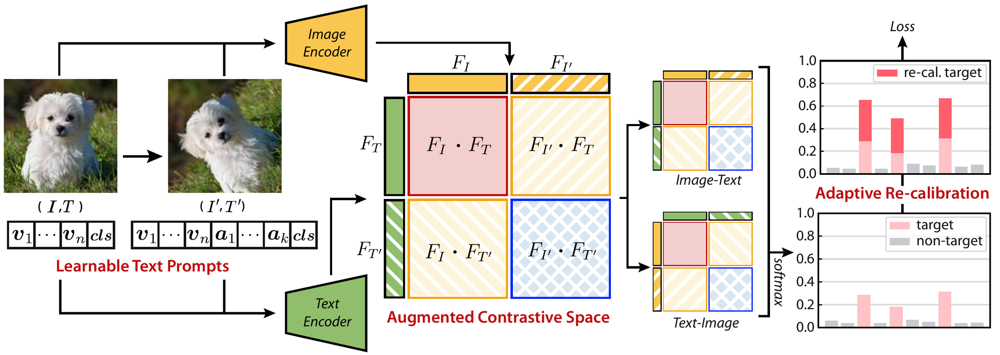

# Re-calibrated Contrastive Loss for Transformation-Aware Prompt Conditioning in Vision-Language Models

Describe each image's **transformation in its text prompt** and **re-calibrate the loss** for multiple positives: better OOD transfer that keeps improving with longer training.

<div align="left">
  <a href="https://bmvc2026.bmva.org/"><picture><source media="(prefers-color-scheme: dark)" srcset="https://raw.githubusercontent.com/SoongE/SoongE/badge/bmvc-2026-dark.svg"></picture></a>
  <a href="https://arxiv.org/abs/2609.06967"><picture><source media="(prefers-color-scheme: dark)" srcset="https://raw.githubusercontent.com/SoongE/SoongE/badge/arxiv-2609.06967-dark.svg"></picture></a>
  <a href="https://huggingface.co/SoongE/ReCalCon"><picture><source media="(prefers-color-scheme: dark)" srcset="https://raw.githubusercontent.com/SoongE/SoongE/badge/checkpoints-dark.svg"></picture></a>
  <a href="LICENSE"><picture><source media="(prefers-color-scheme: dark)" srcset="https://raw.githubusercontent.com/SoongE/SoongE/badge/license-apache-2.0-dark.svg"></picture></a>
</div>

<p align="center">
  
</p>

## Overview
**Re-calibrated contrastive loss.** With many positives per row, softmax cross-entropy dilutes each
positive's gradient by `1/|P(i)|`. The objective adds one adaptive margin `-log ψ(i)`, where `ψ(i)`
is the ratio of aggregate positive to aggregate negative evidence in that row.

**Transformation-aware prompt conditioning.** The prompt `M = [V, A, CLS]` carries a fixed descriptor
`A` naming the RandAugment ops applied to the paired image, so the text is conditioned on the
transformation rather than the class label. This expands the contrastive space to the four matches of `[I I'] ↔ [T T']`.

## Results

Distribution shift with CLIP ViT-B/16, fine-tuned on ImageNet (top-1 accuracy, %). O.M. is the mean over the five
OOD sets and H.M. the harmonic mean of ID and O.M.

| Method | ImageNet | -R | -A | -V2 | -Sketch | ObjectNet | O.M. | H.M. |
| --- | ---: | ---: | ---: | ---: | ---: | ---: | ---: | ---: |
| FFT | 81.3 | 65.6 | 36.6 | 70.7 | 45.1 | 50.7 | 53.7 | 64.7 |
| LP-FT | 81.7 | 73.5 | 42.5 | 72.1 | 50.3 | 55.1 | 58.7 | 68.3 |
| WiseFT | 82.4 | 72.6 | 44.4 | 72.6 | 49.8 | 54.5 | 58.8 | 68.6 |
| FLYP | 82.6 | 71.6 | 48.9 | 72.8 | 49.6 | 55.5 | 59.7 | 69.3 |
| ARF | 82.7 | 75.6 | 50.3 | 72.8 | **51.8** | 55.8 | 61.3 | 70.4 |
| Lipsum-FT | **83.3** | **75.9** | 49.9 | 73.6 | 51.4 | 54.4 | 61.0 | 70.5 |
| RAda-FT | 81.4 | 75.5 | 51.7 | 71.9 | 50.4 | 56.8 | 61.3 | 69.9 |
| **ReCalCon** | **83.3** | 71.6 | **54.9** | **74.1** | **51.8** | **58.4** | **62.2** | **71.2** |

The ReCalCon checkpoint of this row is `distribution_shift/imagenet_b16` on Hugging Face (see [Evaluation](#evaluation)).

## Setup

```bash
uv sync
uv sync --group iwildcam
```

The environment pins PyTorch 2.2.1 + cu121. CLIP weights download to `~/.cache/clip` on first use.
Datasets are read from `data.root` (default `./data`).

### Repository layout

```
configs/         one YAML per experiment
scripts/         train.py, eval.py, summarize.py
src/recalcon/
  config.py      dataclass config, YAML, dotted CLI overrides
  losses.py      the proposed loss and the three it is ablated against
  models.py      CLIP, adapters, learnable prompt, multi-sample fusion
  registry.py
  clip/          OpenAI CLIP, vendored
  data/          datasets, prompts, augmentation, dataloaders
  engine/        trainer, zero-shot and few-shot evaluators
```

### Dataset layout

```
./data
├── imageNet/ imageNet-R/ imageNet-A/ imageNet-V2/ imageNet-Sketch/ objectnet-1.0/
├── iwildcam_v2.0/
├── caltech101/
│   ├── 101_ObjectCategories/           few-shot
│   └── split/{train,val,test}/<class>/ transfer: the CoOp split (splits/split_zhou_Caltech101) as class folders
├── flowers-102/ stanford_cars/ pcam/
├── dtd/ eurosat/ fgvc-aircraft-2013b/ food-101/ oxford-iiit-pet/ SUN397/ UCF-101-midframes/
├── splits/          few-shot splits (ship with this repo)
└── sampling/        few-shot samples (ship with this repo)
```

## Training
```bash
accelerate launch --num_processes 4 -m scripts.train --config imagenet_b16
accelerate launch --num_processes 4 -m scripts.train --config imagenet_b32
accelerate launch --num_processes 4 -m scripts.train --config imagenet_petl_b16
accelerate launch --num_processes 4 -m scripts.train --config iwildcam_b16
accelerate launch --num_processes 4 -m scripts.train --config iwildcam_petl_b16
```

Training evaluates the group in `data.eval` when it finishes and writes `outputs/<run>/results.csv`.
Any field is overridable inline with a dotted flag:

```bash
accelerate launch --num_processes 4 -m scripts.train --config imagenet_b16 --train.epochs 10
```

The ImageNet, iWildCam and transfer configs are set for four GPUs, so that `train.batch_size` × 4 ×
`train.grad_accumulation` equals `train.total_batch`. The contrastive loss gathers features across GPUs, so one step
sees `train.batch_size` × GPUs samples; on a different number of GPUs, scale `--train.batch_size` rather than
`--train.grad_accumulation`, which keeps the optimizer batch but shrinks the contrastive batch.

`python -m scripts.train` also works and runs on one GPU, the first entry of `train.gpus`. Under
`accelerate launch`, select GPUs through the launcher instead.

<details>
<summary><b>Transfer learning and few-shot</b></summary>

```bash
for ds in caltech101 flowers102 stanfordcars pcam; do
  accelerate launch --num_processes 4 -m scripts.train --config transfer_$ds
done
```

Few-shot is one run per dataset and shot count, over the 11 datasets of the `imagenet_xd` group:

```bash
python -m scripts.train --config fewshot_rn50 --data.train dtd --data.eval dtd --data.n_shot 16
```

</details>

<details>
<summary><b>Configs</b></summary>

| config | paper |
| --- | --- |
| `imagenet_b16`, `imagenet_b32` | Table 1, ImageNet, full fine-tuning |
| `imagenet_petl_b16`, `imagenet_petl_b32` | Table 1, Ours (PETL) on ImageNet |
| `iwildcam_b16`, `iwildcam_b32` | Table 1, iWildCam, full fine-tuning |
| `iwildcam_petl_b16`, `iwildcam_petl_b32` | Table 1, Ours (PETL) on iWildCam |
| `transfer_caltech101`, `transfer_flowers102`, `transfer_stanfordcars`, `transfer_pcam` | Table 2 |
| `fewshot_rn50` | Figure 5, ResNet-50 |
</details>

<details>
<summary><b>Ablations</b></summary>

```bash
accelerate launch --num_processes 4 -m scripts.train --config imagenet_b32 --loss.name recalibrated \
  --train.output_dir outputs/ablation_recalibrated
accelerate launch --num_processes 4 -m scripts.train --config imagenet_b32 --loss.name softce \
  --train.output_dir outputs/ablation_softce
accelerate launch --num_processes 4 -m scripts.train --config imagenet_b32 --loss.name infonce \
  --train.output_dir outputs/ablation_infonce
accelerate launch --num_processes 4 -m scripts.train --config imagenet_b32 --loss.name focal \
  --train.output_dir outputs/ablation_focal
```
In this cross-modal setting SupCon has no self-term to exclude, so it reduces to `softce`.

</details>

## Evaluation

```bash
python -m scripts.eval --config imagenet_b16 --eval.checkpoint outputs/imagenet_b16/best.ckpt
python -m scripts.summarize outputs
```

The checkpoints of the paper are on [Hugging Face](https://huggingface.co/SoongE/ReCalCon). Each folder has
`model.safetensors` and a `config.json` naming the config to evaluate it with:

```bash
hf download SoongE/ReCalCon --include "distribution_shift/imagenet_b16/*" --local-dir checkpoints
python -m scripts.eval --config imagenet_b16 \
  --eval.checkpoint checkpoints/distribution_shift/imagenet_b16/model.safetensors
```

## Citation

```bibtex
@inproceedings{oh2026recalibrated,
  title     = {Re-calibrated Contrastive Loss for Transformation-Aware Prompt Conditioning in Vision-Language Models},
  author    = {Oh, Seungmin and Kang, Seunghun and Ryu, Jongbin},
  booktitle = {Proceedings of the British Machine Vision Conference},
  year      = {2026},
  publisher = {BMVA},
  url       = {https://arxiv.org/abs/2609.06967}
}
```

## Acknowledgments

[CLIP](https://github.com/openai/CLIP) (backbone and tokenizer, vendored), 
[CoOp](https://github.com/KaiyangZhou/CoOp) (few-shot splits), 
[CuPL](https://github.com/sarahpratt/CuPL) (few-shot prompts), 
[APE](https://github.com/yangyangyang127/APE) (few-shot evaluation protocol).

## License

[Apache License 2.0](LICENSE). Third-party code and data are listed in [THIRD_PARTY_NOTICES.md](THIRD_PARTY_NOTICES.md).
